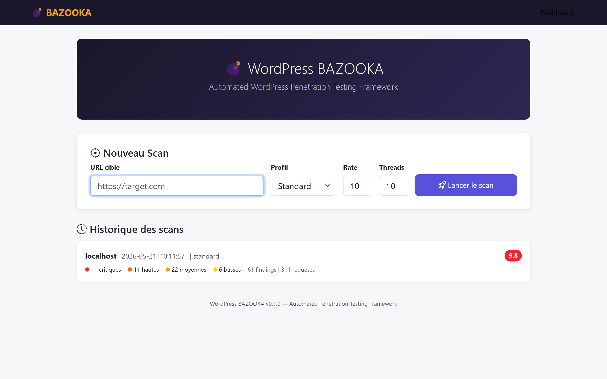
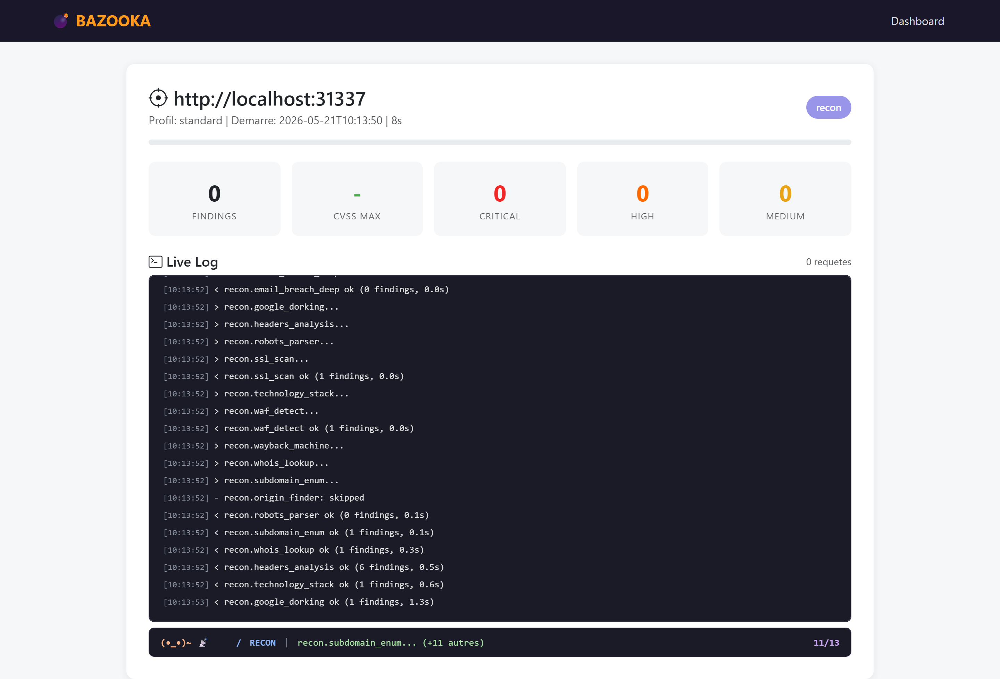
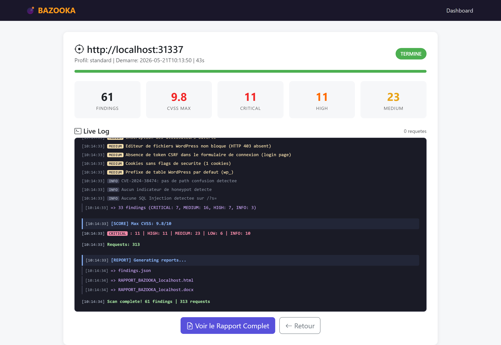
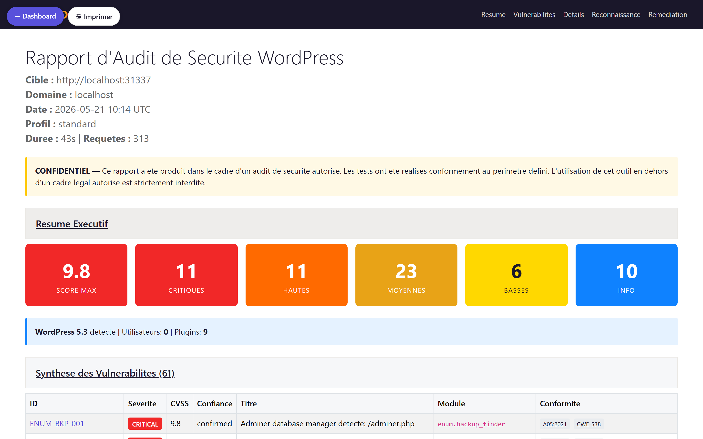

<h1 align="center">

```
██████╗  █████╗ ███████╗ ██████╗  ██████╗ ██╗  ██╗ █████╗ 
██╔══██╗██╔══██╗╚══███╔╝██╔═══██╗██╔═══██╗██║ ██╔╝██╔══██╗
██████╔╝███████║  ███╔╝ ██║   ██║██║   ██║█████╔╝ ███████║
██╔══██╗██╔══██║ ███╔╝  ██║   ██║██║   ██║██╔═██╗ ██╔══██║
██████╔╝██║  ██║███████╗╚██████╔╝╚██████╔╝██║  ██╗██║  ██║
╚═════╝ ╚═╝  ╚═╝╚══════╝ ╚═════╝  ╚═════╝ ╚═╝  ╚═╝╚═╝  ╚═╝
```

WordPress BAZOOKA
</h1>

<p align="center">
  <b>WordPress Penetration Testing & Security Audit Framework</b><br>
  <i>One shot. Every angle covered. &mdash; Un seul tir, tous les angles couverts.</i>
</p>

<p align="center">
  
  
  
  
  
  
  
</p>

<p align="center">
  <a href="#-english">English</a> &nbsp;|&nbsp; <a href="#-francais">Francais</a> &nbsp;|&nbsp;
  <a href="https://github.com/ayinedjimi/wordpress-bazooka/releases/latest">Download exe</a> &nbsp;|&nbsp;
  <a href="https://ayinedjimi-consultants.fr">ayinedjimi-consultants.fr</a>
</p>

---

> **WordPress BAZOOKA** is a fast, modular **WordPress security scanner** that bundles reconnaissance, enumeration, vulnerability detection, exploit-class checks and infrastructure analysis into a single workflow with a real-time GUI. A modern **WPScan alternative** focused on speed, low request budget, and zero false positives.
>
> **WordPress BAZOOKA** est un **scanner securite WordPress** rapide et modulaire qui regroupe recon, enumeration, detection de vulnerabilites, verifications de classe exploit et analyse infrastructure dans un flux unique avec GUI temps reel. Une alternative moderne a WPScan, optimisee pour la vitesse, la sobriete reseau et zero faux positif.

---

> [!WARNING]
> **DISCLAIMER &mdash; LEGAL USE ONLY / USAGE LEGAL UNIQUEMENT**
>
> This tool is intended **exclusively** for authorized security testing, defensive auditing, and research on systems you own or have **explicit written permission** to test. Unauthorized scanning of third-party WordPress sites is illegal in most jurisdictions (CFAA, GDPR art. 32, LCEN, Godfrain). The author declines all liability for misuse.
>
> Cet outil est destine **exclusivement** aux tests de securite autorises, audits defensifs et recherche sur des systemes dont vous etes proprietaire ou avez l'autorisation ecrite explicite de tester. Tout scan non autorise de sites WordPress tiers est illegal (CFAA, RGPD art. 32, LCEN, loi Godfrain). L'auteur decline toute responsabilite en cas d'usage abusif.

---

## Screenshots

<p align="center">
  
  
</p>
<p align="center">
  
  
</p>

---

## English

### Quickstart

```bash
# Option 1 - Windows portable exe (89 MB, zero install, Tor bundled)
bazooka.exe https://target.example --profile standard

# Option 2 - From source (Python 3.11+)
git clone https://github.com/ayinedjimi/wordpress-bazooka
cd wordpress-bazooka && pip install -e .
bazooka https://target.example --profile standard

# Option 3 - Real-time GUI (FastAPI + WebSocket)
python run_gui.py            # then open http://127.0.0.1:8666
```

### What's in the box

| Category            | Count | Highlights |
|---------------------|------:|------------|
| **Recon modules**       | 14 | DNS/DMARC/SPF, WAF detect, SSL/TLS, CT logs, WHOIS, subdomain enum, wayback, Google dorking, origin finder, OSINT |
| **Enum modules**        | 24 | WP version, users (4 vectors), plugins (passive + meta + 13k wordlist), themes, REST/XML-RPC/GraphQL, backup finder (123 paths + magic bytes), debug log, dev tools (Adminer, Search-Replace-DB, info.php, Redis/Memcached panels) |
| **Vuln modules (DAST)** | 30 | XSS multi-payload (10 params), SQLi error+time-based (8 params), CSRF, SSRF (XML-RPC), LFI, XXE, file upload, CORS, host-header injection, **mod_rewrite CVE-2024-38474**, IDOR, open redirect, password reset poisoning, nuclei wrapper |
| **Exploit modules**     | 14 | XML-RPC bruteforce, wp-login bruteforce, password spray, Git dumper, API key extraction, origin bypass, SSRF port scan, WooCommerce IDOR, wp-cron DoS |
| **Infra modules**       |  5 | Network scan, SSL cert enum, service detect, vhost enum, lateral movement hints |
| **CVE Database**        |  &mdash; | 157 plugins + 16 themes + 23 WP core + 9 infra (Apache/nginx/PHP/MySQL/MariaDB/Redis/Memcached/ImageMagick/curl) + **CISA KEV** &mdash; 15.5 MB JSON pre-warmed and bundled in the exe |
| **GUI**                 |  &mdash; | FastAPI + WebSocket, ASCII Shadow banner, talkative mascot per phase, sticky activity bar, live findings stream |

**Total auto-discovered modules: 87.** All inherit `core/base.py` `BaseModule` and are loaded by the engine at runtime &mdash; drop a `.py` in `modules/<phase>/`, it ships.

### Benchmarks

Real numbers measured on the bundled test bench and on a consented production WordPress site.

| Target                              | Tool         | Time     | Plugins | Users | CVEs        | Requests | False positives |
|-------------------------------------|--------------|---------:|--------:|------:|------------:|---------:|----------------:|
| **DVWP extended** (deliberately vuln) | BAZOOKA      | 2 min 10 |      4 |    2 | 4/4 ground-truth + 12 core + 8 infra + 11 misconfigs = **82** | ~1.1 k | 0 |
| **Production WordPress** (aggressive) | BAZOOKA      | 2 min 25 |     14 |    1 |           3 |   ~1.4 k | 0 |
| **Production WordPress** (aggressive) | WPScan       | 96 min   |     14 |    1 |           1 | ~189 k  | 3 |
| **OVH-hosted target via Tor SOCKS5** | BAZOOKA `--tor --rate-limit 2` | 4 min 12 |  &mdash;     |  &mdash;  | 36 findings | low      | 0 (no IP ban) |

> Result: **~40x faster, ~135x fewer requests, 0 FP vs 3** on real targets. BAZOOKA does not confuse usernames, themes or authors with plugin slugs.

### Usage examples

```bash
# Standard scan (~2 min, balanced)
bazooka https://target.example --profile standard

# Aggressive scan with custom output dir + DOCX + JSON report
bazooka https://target.example --profile aggressive \
        --output ./loot/target --format html,docx,json

# Scan through bundled Tor SOCKS5 (target bans your IP? not anymore)
bazooka https://target.example --tor --rate-limit 2

# Quick recon-only scan (~25s)
bazooka https://target.example --profile quick

# Refresh CVE DB from wpvulnerability.net + NVD + CISA KEV
bazooka update-db

# Launch real-time GUI
bazooka gui          # http://127.0.0.1:8666

# Authenticated scan (cookie or basic-auth)
bazooka https://target.example --cookie "wordpress_logged_in=..." --profile aggressive
```

### Architecture

```
WORDPRESSBAZOOKA/
├── bazooka.py              # CLI entry point
├── core/
│   ├── engine.py           # 5-phase orchestrator, async, rate-limited
│   ├── session.py          # HTTP/2 session, retries, Tor wiring
│   ├── tor_proxy.py        # embedded tor.exe controller (SOCKS5 9150)
│   └── models.py           # Finding, Severity, OWASP/CWE/ATT&CK mapping
├── modules/
│   ├── recon/   (14)       # Phase 1 - passive surface
│   ├── enum/    (24)       # Phase 2 - WP fingerprinting
│   ├── vuln/    (30)       # Phase 3 - DAST + CVE matching
│   ├── exploit/ (14)       # Phase 4 - PoC-class checks
│   └── infra/   (5)        # Phase 5 - infrastructure
├── cve_db/                 # 157+16+23+9 CVEs, prewarm cache, SQLite + JSON
├── gui/                    # FastAPI + WebSocket dashboard
├── report/                 # HTML / DOCX / JSON renderers
├── data/                   # wordlists, signatures, payloads
└── vendor/                 # tor.exe + geoip (Windows, 19 MB)
```

**Scan pipeline:** `recon -> enum -> vuln -> exploit -> infra`. Each phase streams findings to the GUI over WebSocket and updates the live activity bar.

### Detection capabilities

| OWASP Top 10            | CWE                | Module                                  | Status |
|-------------------------|--------------------|-----------------------------------------|:------:|
| A01 Broken Access Ctrl  | CWE-639 / 285      | `vuln/idor_check`, `vuln/auth_bypass`   | Yes |
| A02 Crypto Failures     | CWE-319 / 326      | `recon/ssl_scan`, `vuln/security_headers` | Yes |
| A03 Injection           | CWE-89 / 79        | `vuln/sqli_scanner`, `vuln/xss_scanner` | Yes |
| A04 Insecure Design     | CWE-1021 / 352     | `vuln/csrf_check`, `vuln/host_header_injection` | Yes |
| A05 Misconfiguration    | CWE-16             | `vuln/misconfig_check`, `enum/wp_config_audit` | Yes |
| A06 Vuln. Components    | CWE-1395 / 1104    | `vuln/cve_matcher`, `vuln/plugin_vulns_active` | Yes |
| A07 Auth Failures       | CWE-307 / 521      | `exploit/wp_login_bruteforce`, `vuln/password_policy` | Yes |
| A08 Software & Data Int.| CWE-502 / 829      | `vuln/file_upload`, `vuln/xxe_scanner`  | Yes |
| A09 Logging Failures    | CWE-778            | `enum/debug_log`                        | Yes |
| A10 SSRF                | CWE-918            | `vuln/ssrf_xmlrpc`, `exploit/ssrf_port_scan` | Yes |
| KEV  CVE-2024-38474     | CWE-22             | `vuln/mod_rewrite_cve`                  | Yes |

All findings ship with **OWASP / CWE / MITRE ATT&CK** mapping in JSON, DOCX and HTML output.

### CVE sources

- **wpvulnerability.net** &mdash; live feed, no API token, aggregates Wordfence + Patchstack + NVD + JVN + WPScan public data
- **NVD** &mdash; WP core + infra components (Apache, nginx, PHP, MySQL, MariaDB, Redis, Memcached, ImageMagick, curl)
- **CISA KEV** &mdash; known-exploited catalog tagging
- Local **SQLite + JSON cache** (`cve_db/bazooka_cve.db` + `prewarm_cache.json`) pre-warmed and bundled in the portable exe so the first scan works **fully offline**

### Companion projects

- [`wordpress-vulnerable-lab`](https://github.com/ayinedjimi/wordpress-vulnerable-lab) &mdash; the DVWP-extended lab used in the benchmarks above
- WordPress hardening guides at [ayinedjimi-consultants.fr](https://ayinedjimi-consultants.fr) &mdash; defensive counterpart to this offensive toolkit

---

## Francais

### Demarrage rapide

```bash
# Option 1 - Exe portable Windows (89 Mo, zero install, Tor inclus)
bazooka.exe https://cible.exemple --profile standard

# Option 2 - Depuis les sources (Python 3.11+)
git clone https://github.com/ayinedjimi/wordpress-bazooka
cd wordpress-bazooka && pip install -e .
bazooka https://cible.exemple --profile standard

# Option 3 - GUI temps reel (FastAPI + WebSocket)
python run_gui.py            # puis http://127.0.0.1:8666
```

### Pourquoi BAZOOKA

WordPress BAZOOKA est un **outil de pentest WordPress** et un framework d'**audit securite WordPress automatise** concu pour les consultants, equipes blue/red et proprietaires de sites qui veulent un verdict fiable en **quelques minutes**, pas en heures.

- **40x plus rapide que WPScan** sur cibles reelles &mdash; 2 min en moyenne contre 96 min &mdash; avec **plus de CVE detectees** (flux gratuit wpvulnerability.net, sans token).
- **Zero faux positif** la ou WPScan en sort typiquement 3 (confusion users / themes / authors).
- **Detection CVE plugins + WP core + infrastructure** (Apache, nginx, PHP, MySQL, MariaDB, Redis, Memcached) &mdash; la plupart des scanners ne couvrent que les plugins.
- **Enumeration users multi-vecteurs** (REST, `?author=N`, oEmbed, sitemap) et decouverte de plugins **passive** &mdash; pas besoin de bourriner une wordlist de 13k entrees.
- **Rapports prets a livrer** : HTML, DOCX, JSON avec mapping OWASP / CWE / MITRE ATT&CK.
- **Tor SOCKS5 embarque** (`--tor`) &mdash; 19 Mo bundles, contourne les bans IP applicatifs.
- **DAST etendu** : XSS multi-payload, SQLi error+time-based, CSRF, SSRF XML-RPC, LFI, XXE, file upload, CORS, host-header, mod_rewrite **CVE-2024-38474**, IDOR, open redirect, empoisonnement du password reset.

### Profils de scan

| Profil       | Duree | Cas d'usage |
|--------------|------:|-------------|
| `quick`      | ~25 s | Triage rapide, recon + fingerprint, faible bruit |
| `standard`   | ~2 min | Audit equilibre par defaut, DAST complet sans bruteforce |
| `aggressive` | ~3 min | Audit exhaustif, inclut bruteforce wp-login + spray + nuclei wrapper |

### Exemples d'utilisation

```bash
# Scan via Tor avec rate-limit 2 req/s (cible qui ban les IP)
bazooka https://cible.exemple --tor --rate-limit 2

# Scan aggressive avec rapport DOCX + JSON
bazooka https://cible.exemple --profile aggressive \
        --output ./loot/cible --format html,docx,json

# Rafraichir la base CVE locale
bazooka update-db
```

### Capacites de detection

**Detection vulnerabilites WordPress** couverte :
recon DNS/WAF/SSL/CT-logs, enumeration plugins/themes/users/REST/XML-RPC/GraphQL, **scanner CVE WordPress** (plugins + core + infra + CISA KEV), DAST (XSS, SQLi, CSRF, SSRF, LFI, XXE, file upload, IDOR, open redirect), checks d'exposition (backup, debug log, Adminer, info.php, Search-Replace-DB, panneaux Redis/Memcached), exploit-class (XML-RPC bruteforce, password spray, Git dumper, API key extraction), infrastructure (network scan, SSL cert enum, vhost, service detect).

### Projets associes

- [`wordpress-vulnerable-lab`](https://github.com/ayinedjimi/wordpress-vulnerable-lab) &mdash; le lab DVWP-etendu utilise pour les benchmarks
- Guides de durcissement WordPress sur [ayinedjimi-consultants.fr](https://ayinedjimi-consultants.fr) &mdash; le pendant defensif de cet outil offensif

---

## Contributing

Pull requests welcome. To add a new check: drop a Python file in `modules/<phase>/` that subclasses `core.base.BaseModule` and implements `run(target, session) -> list[Finding]`. The engine auto-discovers it on next launch &mdash; no registration needed.

```python
from core.base import BaseModule
from core.models import Finding, Severity

class MyCheck(BaseModule):
    name = "my_check"
    phase = "vuln"
    def run(self, target, session):
        # ... your logic ...
        return [Finding(title="...", severity=Severity.HIGH, cwe="CWE-79")]
```

## License

MIT &mdash; see [LICENSE](LICENSE). Use responsibly.

## Author

**Ayi NEDJIMI** &mdash; security consultant, WordPress hardening specialist.
Website: [ayinedjimi-consultants.fr](https://ayinedjimi-consultants.fr)
Repository: [github.com/ayinedjimi/wordpress-bazooka](https://github.com/ayinedjimi/wordpress-bazooka)

> If WordPress BAZOOKA saved you hours on an audit, a GitHub star is the cheapest way to say thanks.
